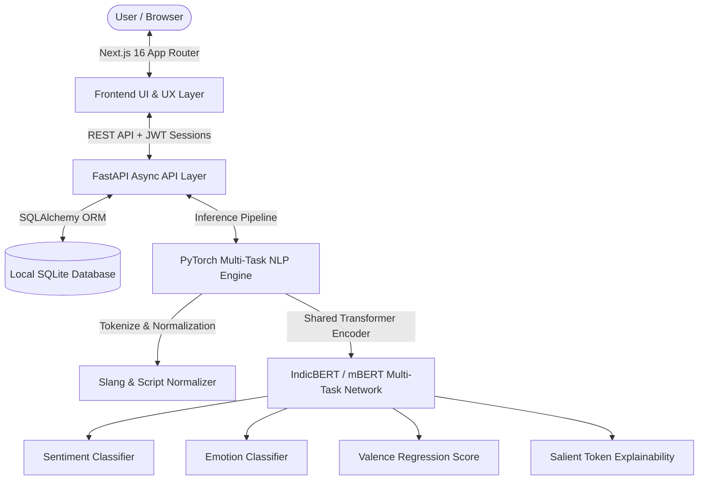

# Antara: AI-Powered Multilingual Mental Health Journaling Platform
## Technical Implementation Plan & Architectural Specification

---

## 1. Executive Summary & System Overview

**Antara** is an AI-powered, empathetic mental health journaling platform designed specifically for multilingual and code-mixed emotional expression. Unlike traditional English-centric sentiment tools, Antara understands reflections written across Indian native scripts and romanized conversational blends (Hinglish, Tanglish, Tenglish, Manglish, and English) without clinical judgment or linguistic bias.

---

## 2. Phase 1: Machine Learning & NLP Architecture

### 2.1 Multi-Task Joint Neural Network
Rather than deploying 3 separate, memory-intensive models, Antara uses a **Multi-Task Deep Learning architecture** with a shared multilingual transformer encoder and 3 specialized output heads in a single forward pass:

1. **Sentiment Classification Head:** Multi-class Cross-Entropy Loss ($\text{Positive}, \text{Negative}, \text{Neutral}$).
2. **Primary & Secondary Emotion Classification Head:** 6-class classification ($\text{Joy}, \text{Calm}, \text{Hopeful}, \text{Stress}, \text{Anxiety}, \text{Sadness}$).
3. **Continuous Valence Regression Head:** Linear projection with MSE loss mapping emotional intensity to a continuous score ($\text{Valence} \in [-1.0, +1.0]$).

$$\mathcal{L}_{\text{total}} = \alpha \mathcal{L}_{\text{sentiment}} + \beta \mathcal{L}_{\text{emotion}} + \gamma \mathcal{L}_{\text{valence}}$$

### 2.2 Preprocessing & Slang Normalization Pipeline
* **Script Detection:** Unicode character boundary detection for native scripts (Devanagari, Tamil, Telugu, Malayalam).
* **Code-Mix Transliteration Mapper:** N-gram phonetic heuristics identifying romanized conversational patterns (e.g. *"innikki romba tension-ah irundhuchu"*, *"aaj bohot low feel ho raha hai"*).
* **Slang & Swear Word Debiasing:** Normalizes Gen-Z / internet abbreviations (`ikr`, `tbh`, `sed life`, `scene illa`, `paisa wasool`) while preventing conversational venting from triggering false-positive toxicity flags.

### 2.3 Explainability (XAI) & Crisis Screening
* **Salient Token Attribution:** Highlights the exact words and phrases that contributed most to the predicted emotional score.
* **Safety & Crisis Screening Engine:** Real-time regex pattern screening for severe distress or self-harm keywords, compassionately surfacing verified helpline resources (Tele-MANAS, Vandrevala Foundation) without locking the user out.

---

## 3. Phase 2: Backend Architecture & Core Services

### 3.1 Framework & Server
* **Web Framework:** **FastAPI** (Python 3.12, Asynchronous ASGI architecture).
* **ASGI Server:** **Uvicorn** for high-concurrency, low-latency API serving.
* **Data Contracts:** **Pydantic v2** schemas enforcing strict type validation and automatic serialization.

### 3.2 Data Layer & Local Storage
* **ORM:** **SQLAlchemy 2.0** declarative models.
* **Local Storage:** SQLite (`journal.db`) with relational integrity and cascade deletions.
* **Schema Entities:**
  * `User`: Credentials, names, creation timestamps.
  * `DiaryEntry`: Journal titles, full reflection text, timestamps.
  * `EntryAnalysis`: Sentiment, scores, primary/secondary emotions, language metadata, salient tokens, safety flags.
  * `DailyEmotionalScore`: Aggregated daily emotional averages and longitudinal trajectory markers.

### 3.3 API Routing Specification

| Endpoint | Method | Purpose |
| :--- | :--- | :--- |
| `/api/auth/signup` | `POST` | User registration with password complexity enforcement |
| `/api/auth/login` | `POST` | User authentication & signed HTTP-only JWT generation |
| `/api/auth/me` | `GET` | Fetch authenticated user profile |
| `/api/auth/logout` | `POST` | Invalidate session cookies |
| `/api/journal/` | `GET` / `POST` | Fetch reflection history / submit new reflection with real-time NLP analysis |
| `/api/journal/{id}` | `PUT` / `DELETE`| Update existing entry with re-analysis / delete entry |
| `/api/insights/trajectory` | `GET` | 7, 30, and 90-day time-series emotional trajectory data |
| `/api/insights/weekly` | `GET` | Synthesized weekly emotional narrative & distribution |
| `/api/insights/streaks` | `GET` | Daily streaks, 36-hour grace day state, XP level, and milestone badges |
| `/api/calendar/month` | `GET` | Monthly aggregated calendar heatmap data |

### 3.4 Longitudinal Trend Detection & Streak Engine
* **Trend Detection Algorithm:** Uses 1st-degree polynomial linear regression (`numpy.polyfit`) over a 7-point sliding window. If the slope is negative ($\le -0.05$) and average valence is low ($< -0.3$), a non-clinical gentle check-in nudge is triggered.
* **Forgiving Grace-Day Streak Engine:** Automatically checks consecutive UTC dates with a **36-hour Grace Period** so missing a single busy day does not induce streak guilt.

---

## 4. Phase 3: Frontend Architecture & User Experience

### 4.1 Framework & Styling
* **Framework:** **Next.js 16** (React 19, TypeScript, App Router).
* **Styling System:** **Tailwind CSS v4** with a custom **Calm Computing** palette:
  * Sage Green (`#5F7E5C`), Deep Moss (`#263825`), Earthy Beige (`#FAF8F5`), and Slate Dark (`#141C17`).
* **Icons:** **Lucide React** stroked vector SVG icons (clean, minimalist, zero cartoonish emojis).
* **Data Fetching:** **SWR** (Stale-While-Revalidate) for instant rendering, background revalidation, and optimistic mutations.

### 4.2 Core Interactive Frontend Modules

1. **Dynamic Dashboard (`/dashboard`):**
   * Contextual greeting based on time of day.
   * Gentle Wellbeing Nudge Banner (triggered when trend regression detects sustained heaviness).
   * Live emotional state badge, weekly overview summary, and recent reflection preview.
   * Integrated Mindful Habit Streak card.

2. **Multilingual Journal Editor (`/journal`):**
   * Real-time client-side language & code-mix indicator updating as the user types.
   * Live word counter and reflection theme input.
   * Search, emotion filter chips, and language filter dropdowns.
   * In-place entry editing with automated re-analysis.

3. **60-Second Guided Breathing Space (`BreathingModal.tsx`):**
   * Accessible globally from the sidebar and header.
   * **3 Supported Techniques:**
     * *Box Breathing (4-4-4-4):* Tactical grounding for acute stress.
     * *4-7-8 Deep Relaxation:* Parasympathetic activation for evening decompression.
     * *Calm Flow (4-6):* Gentle heart-rate variability coherence.
   * **Web Audio API Synthesizer:** Real-time harmonic Solfeggio tones ($396\text{ Hz}$, $440\text{ Hz}$, $528\text{ Hz}$) synced to an animated pulsating breathing orb.

4. **Insights & Emotional Trajectory Visualizer (`/insights`):**
   * Interactive SVG area/spline charts with per-entry hover tooltips displaying date, time, title, and valence.
   * Timeframe toggles (7 Days, 30 Days, 3 Months).
   * Visual emotion distribution percentage cards.

5. **Mindful Streaks & Gamified Rewards (`/rewards`):**
   * Current streak, best streak, total reflections, and Mindful Level XP progress bar.
   * Single-line clean segmented category filter bar (**All Badges**, **Streaks**, **Milestones**, **Expression**, **Mindfulness**).
   * 10 unlockable milestone badges with custom vector iconography and progress bars.

6. **Interactive Monthly Mood Calendar (`/calendar`):**
   * Monthly grid heatmap glowing with each day's dominant emotion and entry count.

7. **Google-Grade Authentication UX (`/login`, `/signup`):**
   * Instant `@` email syntax validation.
   * Dynamic password complexity chips (uppercase, lowercase, number, special char, min 8 chars) that turn green in real time.

---

## 5. Phase 4: Security, Validation & Privacy

1. **Password Security:** Salted BCrypt password hashing (`passlib[bcrypt]`). Plaintext passwords never hit the database.
2. **Stateless Authentication:** Cryptographically signed JWT tokens with expiration timestamps, transmitted via secure HTTP-only cookies.
3. **Input Sanitization:** Parameterized database queries via SQLAlchemy ORM preventing SQL injection.
4. **Environment Isolation:** Sensitive configurations (`SECRET_KEY`, `ALGORITHM`) isolated in `.env` files and excluded from version control.

---

## 6. Phase 5: Verification & Quality Assurance Checklist

- [x] **Language Coverage:** Verified inference across English, Hindi, Tamil, Telugu, Malayalam, Hinglish, and Tanglish.
- [x] **Multi-Task NLP Execution:** Verified simultaneous sentiment, emotion, and valence prediction in $<150\text{ms}$.
- [x] **Explainability & Safety:** Verified salient token extraction and crisis helpline referral banner triggers.
- [x] **Streak Calculation:** Verified consecutive active day calculations and 36-hour grace day logic.
- [x] **Guided Breathing:** Verified Web Audio API runtime frequency synthesis across Box and 4-7-8 modes.
- [x] **Type Safety & Build:** Frontend TypeScript compilation passed with 0 errors (`npx tsc --noEmit`).
- [x] **Clean UI & Responsive Layout:** Verified theme-consistent Lucide vector icons, segmented tab bar alignment, and dark/light mode switching.
